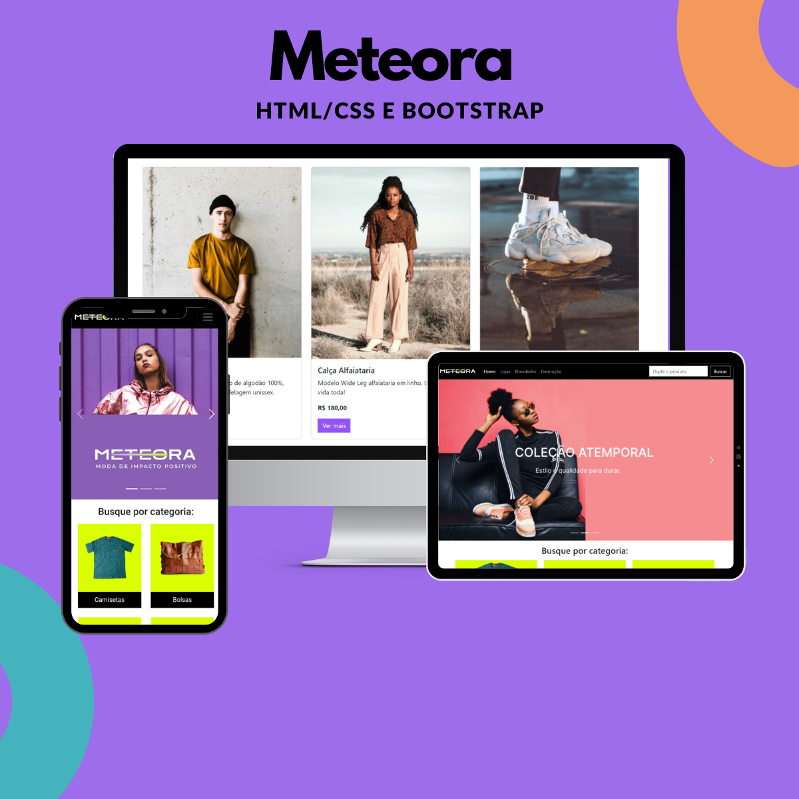

# Bootstrap5
<h1 align="center"> Meteora </h1>

Site desenvolvido em cima de um projeto FIGMA criado pela alura, desenvolvido 100% por mim usando HTML5, CSS3 e Bootstrap.

  <a href="#-tecnologias">Tecnologias</a>&nbsp;&nbsp;&nbsp;|&nbsp;&nbsp;&nbsp;
  <a href="#-projeto">Projeto</a>&nbsp;&nbsp;&nbsp;|&nbsp;&nbsp;&nbsp;
  <a href="#-layout">Layout</a>&nbsp;&nbsp;&nbsp;|&nbsp;&nbsp;&nbsp;

 

  

## 🚀 Tecnologias

Esse projeto foi desenvolvido com as seguintes tecnologias:

- Bootstrap
- HTML, CSS
- Git e Github

## 💻 Projeto

Um site desenvolvido para aprimorar minhas habilidades nas tecnologias HTML, CSS e Bootstrap. Projeto também será usado no meu portfolio.

## 🔖 Layout

Você pode visualizar o layout do projeto através [DESSE LINK](https://www.figma.com/file/7GiJUhoN2xBWwk4wCZvpUN/Meteora---Projeto-Bootstrap-5-(Copy)-(Copy)?type=design&node-id=2386-2430&mode=design&t=MPBzoBpVsycvunSD-0) para acessá-lo.

---

Feito com ♥ by Samuel Oliveira.